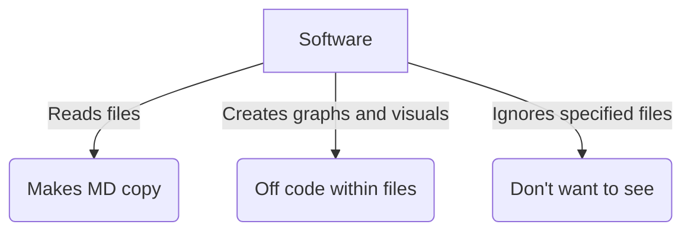

```go


go run rover.md ../your/file/path
Include this in your README, and users can easily understand how to run the code with their desired file path.


```


```mermaid 

graph TD;
  A[Software] -->|Reads files| B(Makes MD copy);
  A -->|Creates graphs and visuals| C(Off code within files);
  A -->|Ignores specified files| D(Don't want to see);


```